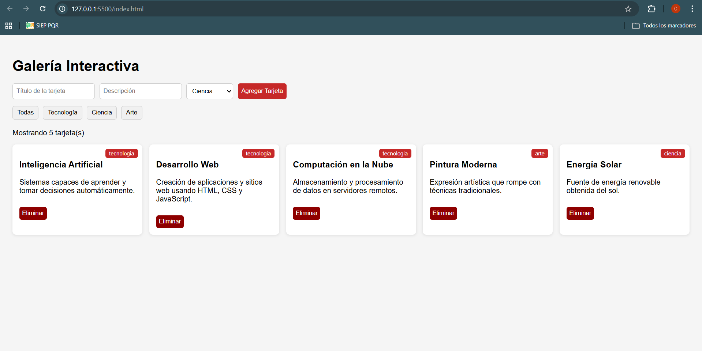
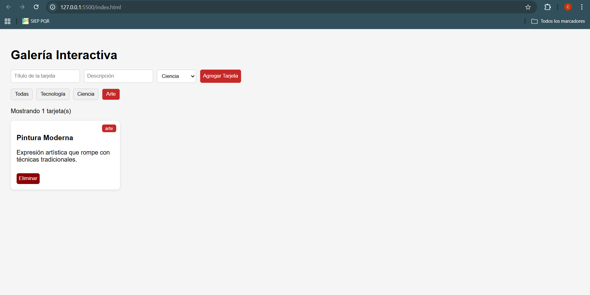
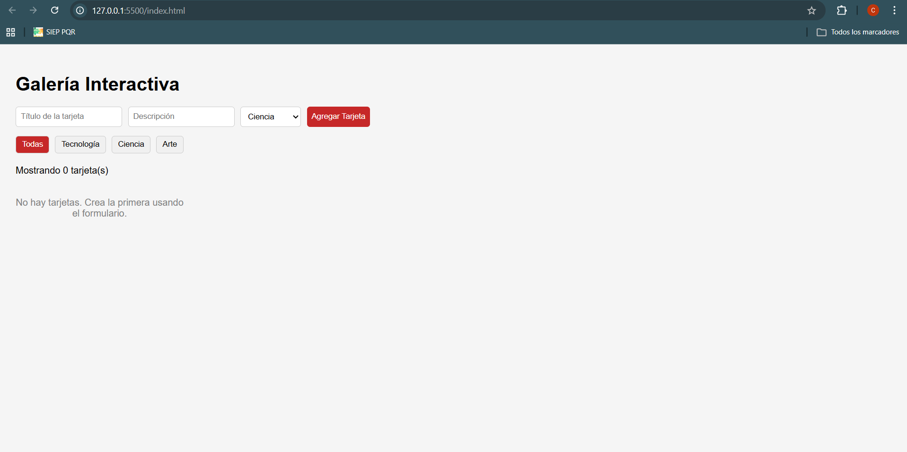

# Galería Interactiva — JavaScript

## 📌 Descripción

Este proyecto consiste en una galería interactiva de tarjetas desarrollada con JavaScript puro, donde el usuario puede crear, eliminar y filtrar tarjetas dinámicamente. Se aplican conceptos fundamentales como manipulación del DOM, eventos y características modernas de JavaScript (ES6).

## 🚀 Tecnologías utilizadas

- HTML5
- CSS3
- JavaScript (ES6)

## ⚙️ Funcionalidades

- Crear tarjetas dinámicamente desde un formulario
- Eliminar tarjetas usando delegación de eventos
- Filtrar tarjetas por categoría (Tecnología, Ciencia, Arte)
- Contador dinámico de tarjetas visibles
- Mensaje automático cuando no hay tarjetas

## ▶️ Cómo ejecutar el proyecto

1. Abrir la carpeta en Visual Studio Code
2. Abrir el archivo `index.html`
3. Ejecutar con la extensión **Live Server**

## 📸 Capturas del proyecto

### Tarjetas creadas

### Filtro por categoría

### Galería vacía

